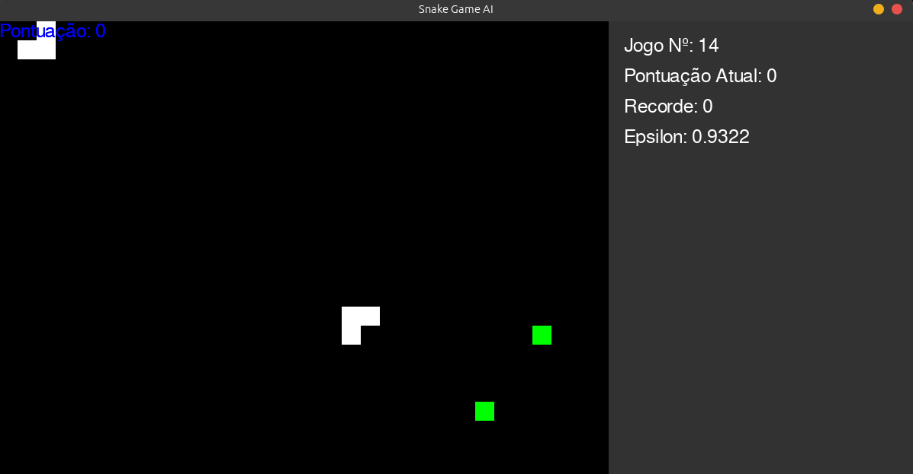

# SnakeAI: Primeiro projeto em Inteligência Artificial

Este projeto representa meu primeiro contato prático com os conceitos de Inteligência Artificial e Aprendizado por Reforço (Reinforcement Learning). O objetivo foi construir, do zero, um agente capaz de aprender a jogar o  "Jogo da Cobra" de forma autônoma.

O que começou como um simples jogo controlado por um humano evoluiu para um sistema de treinamento completo, onde múltiplos agentes aprendem simultaneamente e compartilham conhecimento para dominar o jogo. Nesta manhã de segunda-feira aqui em Campo Grande, este projeto encapsula as primeiras e mais importantes lições da minha jornada em IA.

## 🚀 Funcionalidades

- **Agente Inteligente:** Um agente baseado no algoritmo de **Q-Learning** que toma decisões para maximizar sua pontuação.
- **Treinamento Paralelo:** O sistema pode instanciar múltiplos ambientes de jogo para que vários "robôs" treinem o mesmo "cérebro" (a Tabela-Q) simultaneamente, acelerando o aprendizado.
- **Interface Gráfica Completa:** O ambiente do jogo, construído com Pygame, possui um painel lateral que exibe em tempo real as principais métricas do treinamento, como:
  - Número do Jogo
  - Pontuação Atual
  - Recorde
  - Valor do Epsilon (curiosidade do agente)
- **Visualização do Aprendizado:** Um gráfico é gerado em tempo real usando Matplotlib, mostrando a evolução da pontuação e da pontuação média ao longo dos jogos.
- **Mecânicas Avançadas de RL:** O agente implementa técnicas como:
  - **Memória de Replay (Experience Replay):** Para estabilizar o aprendizado.
  - **Decaimento de Epsilon:** Para balancear a exploração e a explotação de forma inteligente.
  - **Custo de Vida:** Uma penalidade é aplicada se a cobra fica muito tempo sem pontuar, evitando que ela entre em loops infinitos.

## 🛠️ Tecnologias Utilizadas

* `Python 3.12`
* `Pygame` - Para a criação do ambiente do jogo e da interface.
* `Matplotlib` - Para a plotagem do gráfico de performance.
* `IPython` - Para a exibição dinâmica do gráfico.

  